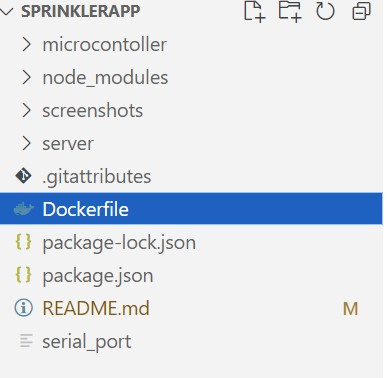

# sprinklerApp
The Sprinkle app allows the user to create their own sprinkle that they can use to water plants at home. The user can choose the time when the sprinkler should work and the duration of watering. The project includes three parts: programming Arduino microcontroller, server-side settings and web interface.

To make this project interactive I created a web interface where a user can set up the time when the sprinkler should start watering the plants and for how long it should run. After the user presses the submit button. Time and duration should be added to the timetable which presents the SQLite database. 

To be able to process requests from the client-side, interact with databases, and generate dynamic content that is sent back to the client I set up Node js run-time environment with Express js framework. Inside my project folder I created app.js file with the following content:

```
var express = require('express'); //import the Express.js framework
var app = express();  //create an instance of the Express application

/*setting middleware*/
//configure Express to parse URL-encoded data from incoming requests 
app.use(express.urlencoded({ extended: true }));
//configure Express to serve static files (such as HTML, CSS, JavaScript, images, etc.) 
//from the "public" folder
app.use(express.static(__dirname + '/public')); 
```

To handle incoming HTTP requests from clients (e.g., web browsers) I added app.listen(8000) at the end of my app.js file. This line instructs the Express application to listen for incoming HTTP requests on port 8000 of the server where the application is running. 

```
//instruct the Express application to listen for incoming HTTP requests on port 8000 
app.listen(8000);
```

Inside my app.js file I created an SQLite database to store the time and duration. The user can add and delete data from the database.

```
//create a new SQLite database object named scheduleDB and open the SQLite database file located at "db/schedule.db"
//It initializes a connection to this database
var scheduleDB = new sqlite3.Database("db/schedule.db");

scheduleDB.run("CREATE TABLE IF NOT EXISTS 'schedule' (id INTEGER PRIMARY KEY, time TEXT, duration INTEGER)");
```
scheduleDB.run() command checks if the database exists and if not it creates a new one.

I used app.get() routing to handle GET request which is sent by the client when they want to open the web-page. When the app receives a request to to the home page route a callback function is called. Inside the callback function I create the response which presents the data from each row of the table (id, time and duration). 
```
app.get('/', function (request, response) {

  scheduleDB.all("SELECT * FROM schedule", function(err, rows) {  
    var timeAndDuration = [];

    rows.forEach(function (row) {
      if (err) {
        return console.log(err.message);
      }  
      timeAndDuration.push({"index": row.id, "time": row.time, "duration": row.duration});
    });
    console.log(timeAndDuration);
    response.render( 'index', { timeAndDuration : timeAndDuration });
  });
});
```

scheduleDB.all("SELECT * FROM schedule", function(err, rows)) retrieves all rows from the table.  If there is an error during this operation, it's passed as the err parameter. If the query is successful, the result rows are passed as the rows parameter.

To render the home page and send a rendered HTML I use response.render() method which takes 'index' argument as the file path to the file to render, and an object  whose properties define local variables for the view. In my case this object is timeAndDuration array inside which I push objects containing three properties: "index," "time," and "duration." 

I wanted to generate content dynamically. To to that I added the following command in my app.js file.

```
app.set('view engine', 'ejs');
```
The first argument in the set() method is the configuration setting I want to modify. In my case, it's the view engine. The second parameter specifies the view engine I want to use which is ejs template that allow me to render HTML content dynamically. 

Index.ejs file presents the copy of my index.html file with the modified table where I inserted JavaScript variable into the HTML table in order to generate the table dynamically based on data from the "timeAndDuration" array. If the user wants to add or delete a row it will also be displayed dynamically.

```
<div id="tableContainer">
    <table id="timeTable">
        <tr>
            <th>Time</th>
            <th>Duration</th>
            <th>Turn on/off</th>
            <th>Delete</th>
        </tr>
        <% timeAndDuration.forEach(function (item, i) {%>
        <tr>
            <td> <%=item.time%> </td>
            <td> <%=item.duration%> </td>
            <td> 
                <label class='switch'>
                    <input type='checkbox'>
                    <span class='slider round'></span>
                </label>
            </td>
            <td>
                ">
            </td>
        </tr>
        <%});%>
    </table>     
</div>
```
When the user clicks the submit button to add time and duration to the database the submit even is called. Since a page can't be manipulated safely until the page DOM is ready I used $(document).ready(function()) so the submit event can be executed once the page is uploaded. Once the user clicks the submit button the function will be executed. 

Before I send the time and duration inside the POST request to ```/add_time_to_table``` url I need to retrieve these values. To do that I wrap the HTML form in a jQuery object and then search for the values in it. After the values are found the POST request can be sent. If the request is successful the new row will be added to the HTML table with the time and duration values along with the delete button. I retrieve id from the POST response body and add this value to the id attribute inside the delete button.

To make it possible to delete just added row without reloading the web-page the delete button is assigned a click event handler (deleteButtonOnClick) for deleting rows.

```
// Attach a submit handler to the form
$( document ).ready(function(){
    $ ( "#addNewRow" ).on( "submit", function() {

        // Stop form from submitting normally
        event.preventDefault();

        // Get some values from elements on the page:
        var $addNewRowForm = $(this),
        time = $addNewRowForm.find( "input[type='time']" ).val()
        duration = $addNewRowForm.find( "input[type='number']" ).val()
        url = "/add_time_to_table";

        // Send the data using post
        $.post( url, { time : time, duration : duration}, 
            function(data, status, jqXHR){
            if (status == "success") {
                var tableRef = document.getElementById("timeTable");
                var newRow = tableRef.insertRow(-1);
                var timeCell = newRow.insertCell(0);
                var durationCell = newRow.insertCell(1);
                var deleteCell = newRow.insertCell(2);

                var imgIdFirstPart = "buttonId-";
                var imgId = imgIdFirstPart.concat(data);

                const deleteButton = "";
                
                timeCell.innerHTML = time;
                durationCell.innerHTML = duration;
                deleteCell.innerHTML = deleteButton;

                $("#" + imgId).on("click", deleteButtonOnClick);
            }
            else {
                alert("An Error Occurred");
            }
        });
    });
});
```
To handle a POST request to add a new row to the database table I use app.post() routing. The application “listens” for requests that match the /add_time_to_table' route, and when it detects a match, it calls a callback function.

Inside the callback function I retrieve time and duration from the request body and run the INSERT query with these values to add new row to the database. 

Since I will need add the row id to the HTML table so I can easily detect the row I need to delete from the database, I send the row id inside the POST response.  

```
app.post('/add_time_to_table', function (request, response) {
  var time = request.body.time;
  var duration = request.body.duration;
  var insertQuery = "INSERT INTO schedule (time, duration) VALUES (strftime('%H:%M', (?)), (?))";
  var valuesArray = [time, duration];
  
  scheduleDB.run(insertQuery, valuesArray, function(err) {
    if (err) {
      return console.log(err.message);
    }
    var id = this.lastID;
    response.send(id.toString());
  });
});
```

When the user clicks the delete button the onclick even is called. Since a page can't be manipulated safely until the page DOM is ready I used $(document).ready(function()) so the onclick event can be executed once the page is uploaded. Once the user clicks the delete button on click event is triggered deleteButtonOnClick() is called.

```
// Attach a delete handler to the form
  $(document).ready(function(){
      $(".deleteButton").on("click", deleteButtonOnClick);
  });
```
Inside deleteButtonOnClick() function I wrap the clicked button in a jQuery object and then retrieve the database row id which is located inside the delete image id ```">```. After retrieving the row id I send POST request. If the request was successful I the response was received I use JQuery method to find the closest to the delete button <tr> tag and then remove it.  

```
var deleteButtonOnClick = function() {
                            
    // Get some values from elements on the page:
    var deleteRowBtn = $(this);
    var id = $(this).attr("id").slice(9);

    // Send the data using post
    $.post("/delete_row", {id : id}, 
        function(data, status, jqXHR){
        if (data == id) {
            $(deleteRowBtn).closest("tr").remove();
        }
        
        else {
            alert("An Error Occurred");
        }
    });
};
```

If the user clicked the delete image the row with the corresponding data should be deleted form the database and it also should be dynamically displayed on the web-page. To handle a POST request to delete a row from a database table I use app.post() routing. The application “listens” for requests that match the /delete_row' route, and when it detects a match, it calls a callback function. 

```
app.post('/delete_row', function (request, response) {
  //retrieves the value of the 'id' field that needs to be deleted from the request body  
  var id = request.body.id;

  //SQL query to delete a row from the 'schedule' table
  var deleteQuery = "DELETE FROM schedule WHERE id=(?)";

  scheduleDB.run(deleteQuery, id, function(err) {
    if (err){
      return console.log(err.message);
    }
  });
  response.send(id);
});
```

To execute DELETE statement I use the run() method inside the callback function. Here, it executes the SQL DELETE query. It provides the 'id' as the value to replace the placeholder (?) in the query. The callback function checks if there was an error during the execution of the DELETE query.

The program should check the time in the database every minute. If the time is in the database the watering duration should be split into 2 bytes and written into serial_port file which then send these bytes to microcontroller via bloototh. 

To check the time every minute I use setInterval() method which calls checkTime() function every 60 seconds.

Inside the checkTime() function I create the Date object with the current time. Since the time insid the database is store in HH:MM format I call getHours() and getMinutes() method inside curTime variable.After that I use curTime to inside the SELECT query to find the corresponding time inside the database. 

If the row with the searching time was found I get the duration value and then split it into 2 bytes which will be send to the microcontroller. To send these bytes I create serial_port file and write those bytes in it. 

```
setInterval(checkTime, 10000);

function checkTime(){
  var checkTimeQuery = "SELECT time, duration FROM schedule WHERE time=(?)";
  var date = new Date();
  var curTime = date.getHours() + ":" + date.getMinutes();
  scheduleDB.get(checkTimeQuery, curTime, function(err, row){
    if (err) {
      console.log(err.message);
    }
    else {
      if (row) {
        var duration = parseInt(row.duration);
        var msb = duration >> 8;
        var lsb = duration & 0xFF;

        const buf = Buffer.allocUnsafe(2);
        buf.writeUInt8(msb, 0);
        buf.writeUInt8(lsb, 1);
        console.log("The time is " + row.time + " The sprinkle will water the plants for " + duration + "milliseconds");
        
        fs.writeFile('serial_port', buf, err => {
          if (err) {
            console.error(err);
          }
        });
      }
    } 
  });
};
```
To make it easy to put new versions of software and run the code in different environments I decided to create a Linux container with my Node js app.

First I created a docker file inside my app folder.



To run the docker I firstly created its image. I followed the example which I found on the official Node js website: https://nodejs.org/en/docs/guides/nodejs-docker-webapp. 

```# Use an official Node.js runtime as the base image
FROM node:18

# Set the working directory in the container
WORKDIR /root

# Copy package.json and package-lock.json to the container
COPY package*.json ./

# Install application dependencies
RUN npm install

# Copy the application code into the container
COPY server ./

EXPOSE 8000
# Specify the command to run your application
CMD ["node", "app.js"]```

After 

#docker run -p 8000:8000 -e TZ=America/Los_Angeles -v C:\Users\Anna\Documents\sprinklerApp\serial_port:/root/serial_port  -v C:\Users\Anna\Documents\sprinklerApp\server\db\schedule.db:/root/db/schedule.db -it sprinkle-app


