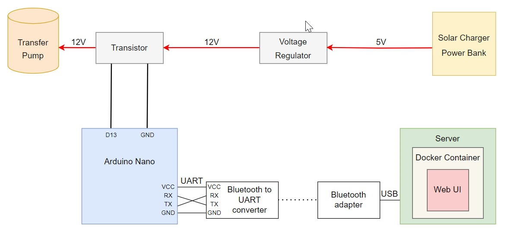

# Introduction

I made this project to automatically water the plants on my balcony. It makes watering process more even and I don't have to worry if I miss to water the plants on my own. 

# System structure 

The system consists of 8 part, the detailed description of each part is presented below. 

The simplified structure is shown on the picture below.

Solar Charger Power Bank
Since I decided to use this sprinkler for my balcony plants I used a Solar Charger Power Bank that can be charged via solar. The power bank has a USB port which I use connect to the Voltage Regulator and supply it with 5V. 
Link to the Solar Charger Power Bank: https://www.amazon.com/dp/B0BMLF8V7G

Voltage Regulator

Since the Transfer Pump needs 12V of power supply and the Power Bank produces only 5V, I needed to use a Voltage Regulator to convert the voltage from 5V to 12V. 
Link to the Voltage Regulator: https://www.amazon.com/gp/product/B082XQC2DS?th=1

Transistor

The Voltage Regulator is connected to the Transistor which is controlled by a signal that it receives from Arduino Nano. When the Transistor gets the signal it passes 12V to the Transfer Pump.
Link to the Transistor: https://www.amazon.com/gp/product/B082XQC2DS?th=1

Transfer Pump

When the Transistor passes 12V to the Transfer Pump it starts pumping the water from a jerrycan and transfer it to the plants via the silicone tube. The Pump continues pumping the water while the signal is send to the Transfer. 

Link to the Pump: https://www.amazon.com/dp/B09XH1GYYQ 

Arduino Nano

The microcontroller receives the signal from the server via bluetooth. Arduino Nano and bluetooth are connected via UART protocol. The bluetooth has a UART module which sends a signal via UART protocol. When the microcontroller receives the signal the PIN goes to the high state and the signal is sent to the transistor. 

Link to Arduino Nano: https://www.amazon.com/dp/B07R9VWD39

Bluetooth to UART Converter

For Arduino Nano I needed a specific Bluetooth which has a UART module so it can sends the signal to  Arduino Nano via UART protocol.

Link to Bluetooth to UART converter: https://www.amazon.com/dp/B01G9KSAF6

Server:

Web UI: 

To make it easier for the user to add and delete time when the sprinkle should start watering plants. I created a Web UI where the user can add the time and watering duration to the table or delete it. All the data is store in the database which is checked by the program every minute. If the current time corresponds to the time in the database then the watering duration will be split into 2 bytes and sent via the serial_port file to virtual COM Port associated with the Bluetooth Adapter. 

Docker Container:

To make it easier to install new dependencies or run the program in different environments I created a docker container. The serial_port file bounds to the virtual serial_port device outside of the container. When the container starts the content of the serial_port file is forwarded to the Bluetooth Adapter. 

Bluetooth Adapter

I needed a Bluetooth Adapter so the server can send the signal over bluetooth. The Server is connected to the Bluetooth Adapter via USB.

Link to Bluetooth Adapter: https://www.amazon.com/dp/B07V1SZCY6

