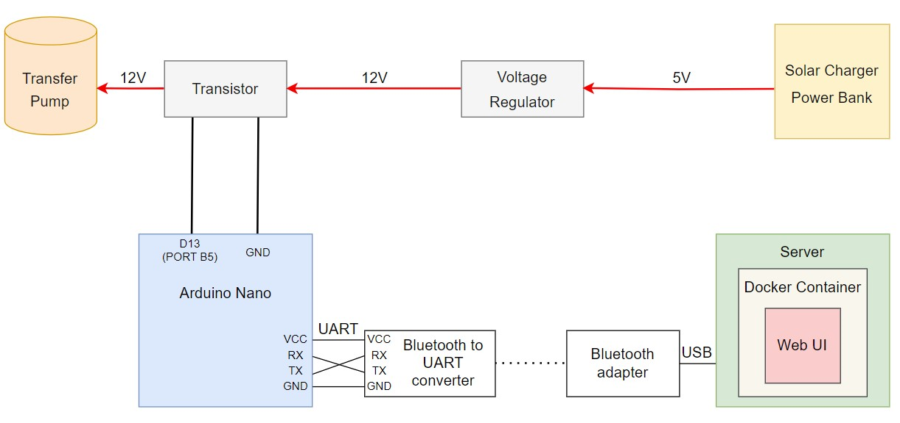

# Introduction

I developed this project to automate the process of watering the plants on my balcony. It ensures an even watering process and eliminating concerns about missing plant care. 

# System structure 

The system consists of eight parts, each described in detail below. A simplified structure is illustrated in the picture below:



### Solar Charger Power Bank

For my balcony plant sprinkler, I use a Solar Charger Power Bank that can be charged via solar energy. The power bank has a USB port, which I use to connect to the Voltage Regulator and supply it with 5V.

Link to the Solar Charger Power Bank: https://www.amazon.com/dp/B0BMLF8V7G

### Voltage Regulator

I used a Voltage Regulator to convert the voltage from 5V to 12V, as the Transfer Pump requires a 12V power supply while the Power Bank produces only 5V. 

Link to the Voltage Regulator: https://www.amazon.com/gp/product/B082XQC2DS?th=1

### Transistor

The Voltage Regulator is connected to the Transistor, which is controlled by a signal received from the Arduino Nano. When the Transistor receives the signal, it passes 12V to the Transfer Pump.

Link to the Transistor: https://www.amazon.com/gp/product/B082XQC2DS?th=1

### Transfer Pump

Upon receiving 12V from the Transistor, the Transfer Pump starts pumping water from a jerrycan and transfers it to the plants via a silicone tube. The Pump continues pumping water while the signal is sent to the Transfer.

Link to the Pump: https://www.amazon.com/dp/B09XH1GYYQ 

### Arduino Nano

The microcontroller receives signals from the server via Bluetooth. The Arduino Nano and Bluetooth are connected using the UART protocol. The Bluetooth has a UART module that sends signals via the UART protocol. When the microcontroller receives the signal, the PIN goes to a high state, and the signal is sent to the transistor. 

Link to Arduino Nano: https://www.amazon.com/dp/B07R9VWD39

### Bluetooth to UART Converter

To work with the Arduino Nano, I needed a specific Bluetooth module with a UART module to send signals to the Arduino Nano via the UART protocol.

Link to Bluetooth to UART converter: https://www.amazon.com/dp/B01G9KSAF6

### Bluetooth Adapter

To send signals from the server over Bluetooth I used a Bluetooth Adapter. The server connects to the Bluetooth Adapter via USB.

Link to Bluetooth Adapter: https://www.amazon.com/dp/B07V1SZCY6

### Server:

#### Web UI: 

To simplify the process of adding or deleting watering schedules, I created a web-based user interface (UI) where users can add the watering times and durations into a table or delete them. All data is stored in a database that the program checks every minute. If the current time matches any time in the database, the watering duration is split into two bytes and sent via the `serial_port` file to a virtual COM Port associated with the Bluetooth Adapter.

#### Docker Container:

To simplify the installation of new dependencies or running the program in different environments, I created a Docker container. The `serial_port` file is bound to the virtual serial_port device outside of the container. When the container starts, the content of the `serial_port` file is forwarded to the Bluetooth Adapter.

```
docker run -p 8000:8000 -e TZ=America/Los_Angeles -v ${pwd}/serial_port:/root/serial_port  -v ${pwd}/server/db/schedule.db:/root/db/schedule.db -it sprinkle-app
```

I specified port mapping with ```-p 8000:8000 ```, so the app inside the container listens on port 8000, making it accessible at ```http://localhost:8000``` on the client's local machine.

To ensure that the time inside the container matches the client's local time, I've set the time zone to America/Los_Angeles using ```-e TZ=America/Los_Angeles```.

Additionally, this command mounts the ```schedule.db``` file from my local machine to the ```/root/db/schedule.db``` file inside the container to provide data to the container.